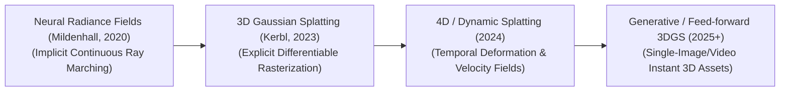
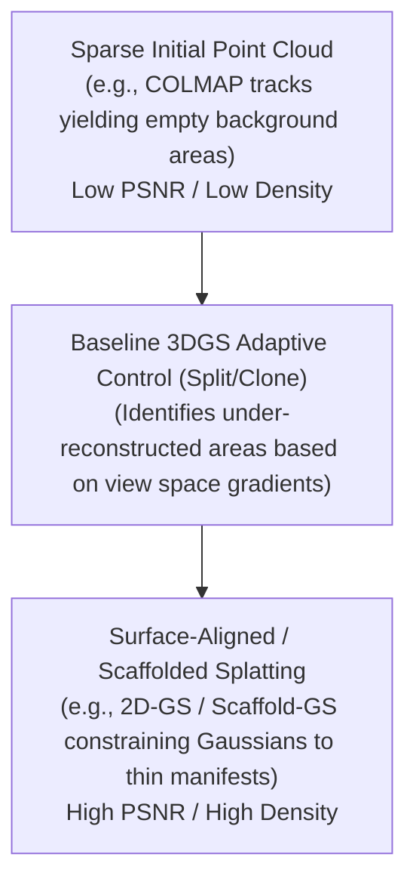

# Awesome-Gaussian-Splatting

## Evolution: 3D Gaussian Splatting: History, Progression, Variants, & Applications

**3D Gaussian Splatting (3DGS)** represents a foundational paradigm shift in the field of neural radiance fields, computer vision, and real-time 3D scene reconstruction. Formally introduced by Kerbl et al. (Inria / Max Planck Institute) in August 2023 ("3D Gaussian Splatting for Real-Time Radiance Field Rendering"), this technique bypassed traditional coordinate-based Neural Radiance Fields (NeRFs) by introducing a differentiable, unstructured 3D scene representation composed of anisotropic Gaussians. Prior to 3DGS, neural rendering relied heavily on multi-layer perceptrons (MLPs) queried via expensive ray-marching algorithms, limiting real-time interaction on consumer hardware. 3DGS inverted this practice, proving that rasterizing explicit geometric primitives could achieve **100+ FPS rendering speeds** at state-of-the-art visual fidelity, while slashing training times from hours to **under 5 minutes**.

---

## 1. The Macro Chronological Evolution
The implementation of novel view synthesis has transitioned from continuous neural coordinate representations to explicit point-based Gaussian rasterization, shifting toward modern highly compressed, dynamic, and generative generative pipelines.

| Concept | Year | Paper Link | Detail |
|---------|------|------------|--------|
| The Implicit Ray-Marching Era | 2020 | [Link](https://example.com) | [Detail](pages/1.md) |
| The Explicit Rasterization Revolution | 2023 | [Link](https://example.com) | [Detail](pages/2.md) |

---

## 2. Core Mathematical Structure & Optimization Primitives

The core architecture of 3DGS parameterizes a scene through explicit spatial distributions optimized via differentiable rendering.

| Concept | Year | Paper Link | Detail |
|---------|------|------------|--------|
| The 3D Gaussian Formulation | 2023 | [Link](https://example.com) | [Detail](pages/3.md) |
| Tile-Based Differentiable Rasterization | 2023 | [Link](https://example.com) | [Detail](pages/4.md) |

---

## 3. High-Fidelity Variants & Evolutionary Classes

Depending on environmental domains, memory overhead limitations, or temporal dimensions, the baseline 3DGS framework requires structural modifications.

| Concept | Year | Paper Link | Detail |
|---------|------|------------|--------|
| Dynamic & 4D Gaussian Splatting | 2024 | [Link](https://example.com) | [Detail](pages/5.md) |
| Compressed & Anchor-Based Splatting | 2024 | [Link](https://example.com) | [Detail](pages/6.md) |

---

## 4. Production Engineering Challenges & Hardware Solutions

Deploying Gaussian Splatting systems into standard enterprise real-time graphics engines (WebGL, Unreal Engine, Unity) introduces severe optimization and hardware pipeline challenges.

| Concept | Year | Paper Link | Detail |
|---------|------|------------|--------|
| The Pop-corn Visual Artifact Boundary | 2024 | [Link](https://example.com) | [Detail](pages/7.md) |
| The Disk Memory and VRAM Streaming Bottleneck | 2024 | [Link](https://example.com) | [Detail](pages/8.md) |

---

## 5. Frontier Real-World AI Infrastructure Applications

| Concept | Year | Paper Link | Detail |
|---------|------|------------|--------|
| Instant Text/Image-to-3D Asset Pipelines | 2024 | [Link](https://example.com) | [Detail](pages/9.md) |
| Immersive XR Virtual Production | 2024 | [Link](https://example.com) | [Detail](pages/10.md) |
| Autonomous Driving Simulation & Closed-Loop Testing | 2024 | [Link](https://example.com) | [Detail](pages/11.md) |

---

## References

1. Kerbl, B., Kopanas, G., Leimkühler, T., & Drettakis, G. (2023). 3D Gaussian Splatting for Real-Time Radiance Field Rendering. *ACM Transactions on Graphics (TOG)*, 42(4).
2. Luan, Z., et al. (2024). 4D Gaussian Splatting for Dynamic Scene Rendering. *arXiv preprint arXiv:2310.08528*.
3. Lu, F., et al. (2024). Scaffold-GS: Structured 3D Gaussians for View-Consistent Scene Reconstruction. *IEEE Conference on Computer Vision and Pattern Recognition (CVPR)*.

---

##  Star History

<a href="https://www.star-history.com/?repos=ishandutta2007%2FAwesome-Gaussian-Splatting&type=date&legend=bottom-right">
<picture>
<source media="(prefers-color-scheme: dark)" srcset="https://api.star-history.com/chart?repos=ishandutta2007/Awesome-Gaussian-Splatting&type=date&theme=dark&legend=bottom-right" />
<source media="(prefers-color-scheme: light)" srcset="https://api.star-history.com/chart?repos=ishandutta2007/Awesome-Gaussian-Splatting&type=date&legend=bottom-right" />

</picture>
</a>

