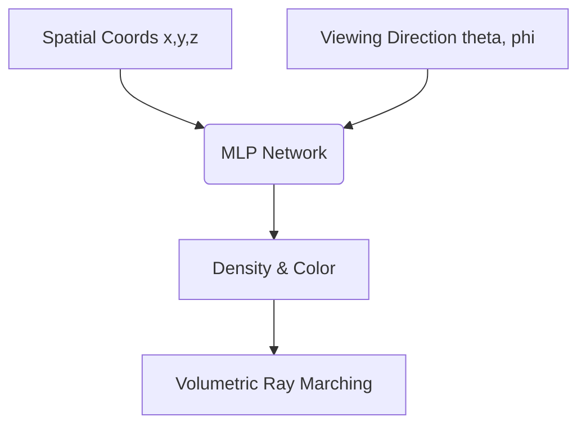

# The Implicit Ray-Marching Era

Neural Radiance Fields (NeRFs) introduced the concept of implicit continuous representation for 3D scenes. By mapping spatial coordinates and viewing directions to volume density and RGB color, NeRFs could render novel views using volumetric ray marching.

