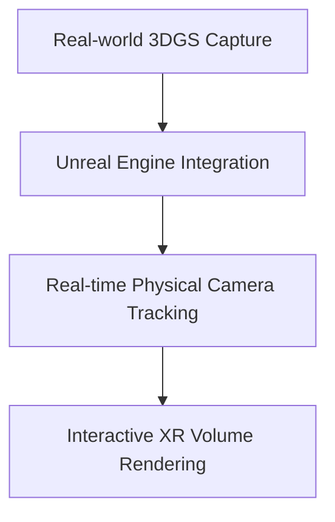

# Immersive XR Virtual Production

Game engines like Unreal Engine and Unity have integrated 3DGS plugins to stream photorealistic captures into virtual production volumes dynamically, replacing traditional green screens.

