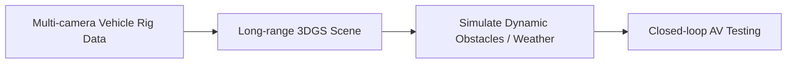

# Autonomous Driving Simulation

Using 3DGS to model massive long-range street scenarios from vehicle cameras. Autonomous agents can be safely tested in simulated, hyper-realistic, dynamic 3D environments.

