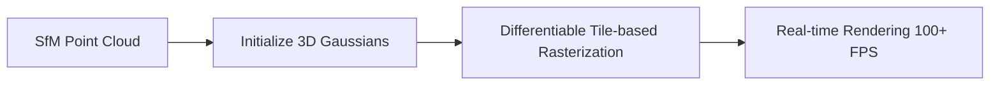

# The Explicit Rasterization Revolution

3D Gaussian Splatting (3DGS) replaces neural ray marching with an explicit representation of a scene using millions of 3D Gaussians. These are rasterized to screen space using highly parallelized techniques, offering real-time rendering.

