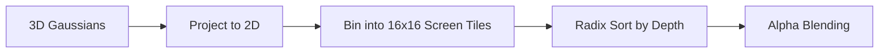

# Tile-Based Differentiable Rasterization

The rasterizer projects 3D Gaussians onto the 2D screen by sorting them depth-wise into 16x16 tiles. It then performs alpha blending over the sorted Gaussians to compute the final pixel color quickly and differentiably.

