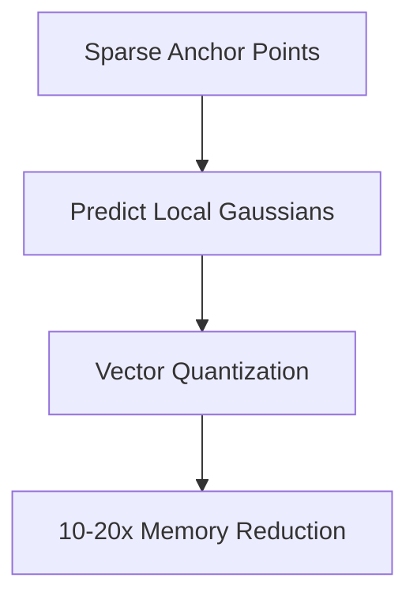

# Compressed & Anchor-Based Splatting

Standard 3DGS consumes massive VRAM. Scaffold-GS and similar methods create sparse anchor points that spawn local Gaussians dynamically, heavily reducing the memory footprint while maintaining quality.

