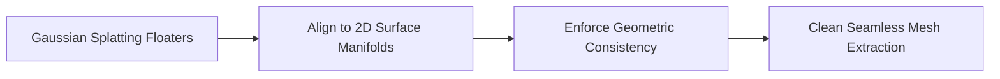

# The Pop-corn Visual Artifact Boundary

During adaptive control, Gaussians splitting and cloning can cause visual artifacts like floaters. Methods like SuGaR and 2D-GS align Gaussians to flat 2D surface manifolds to improve surface quality and allow smooth mesh extraction.

