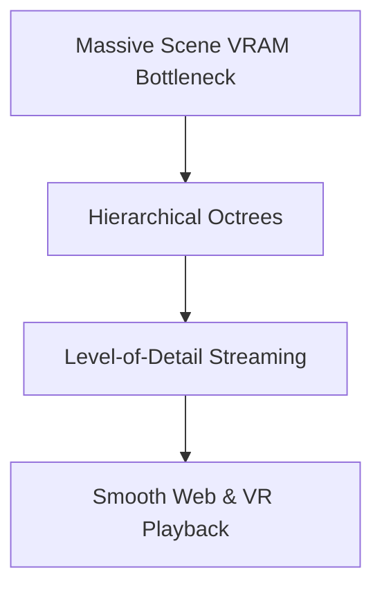

# The Disk Memory and VRAM Streaming Bottleneck

Massive Gaussian clouds choke web viewers and VRAM. Hierarchical Level-of-Detail (LOD) trees solve this by downsampling or streaming low-frequency Gaussians for distant views dynamically.

