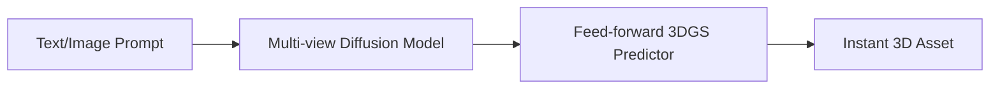

# Instant Text/Image-to-3D Asset Pipelines

Integrating multi-view diffusion models with 3DGS allows for near-instant generative 3D asset creation from single images or text prompts, bypassing the long iteration times of NeRF-based generators.

